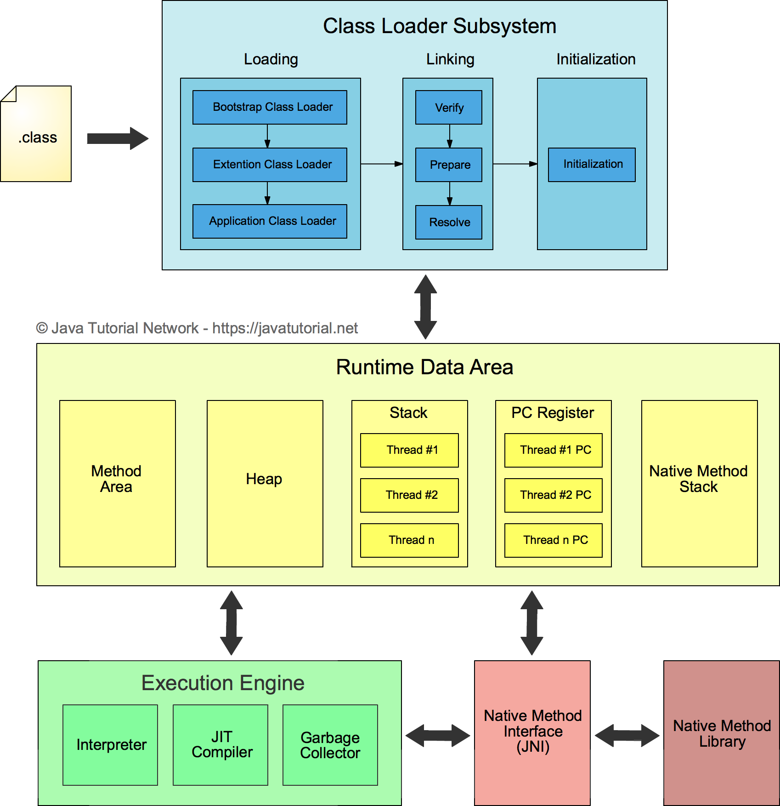

# JVM底层原理
## 一、JVM
java虚拟机(java virtual machine，JVM)，一种能够运行java字节码的虚拟机。作为一种编程语言的虚拟机，实际上不只是专用于Java语言，只要生成的编译文件匹配JVM对加载编译文件格式要求，任何语言都可以由JVM编译运行。比如kotlin、scala等。
jvm有很多，不只是Hotspot，还有JRockit、J9等等。
## 二、 JVM的基本结构
### 1. JVM由三个主要的子系统构成
* 类加载子系统
* 运行时数据区（内存结构）
* 执行引擎


### 2. 运行时数据区（内存结构）
#### 2.1 方法区（Method Area）
类的所有字段和方法字节码，以及一些特殊方法如构造函数，接口代码也在这里定义。简单来说，所有定义的方法的信息都保存在该区域，静态变量+常量+类信息（构造方法/接口定义）+运行时常量池都存在方法区中，虽然Java虚拟机规范把方法区描述为堆的一个逻辑部分，但是它却有一个别名叫做Non-Heap（非堆），目的应该是为了和Java的堆区分开。
#### 2.2 堆（Heap）
虚拟机启动时自动分配创建，用于存放对象的实例，几乎所有对象都在堆上分配内存，当对象无法在该空间申请到内存是将抛出OutOfMemoryError异常。同时也是垃圾收集器管理的主要区域。


##### 2.2.1 新生代（Young Generation）
类出生、成长、消亡的区域，一个类在这里产生，应用，最后被垃圾回收器收集，结束生命。
新生代分为两部分：伊甸区（Eden space）和幸存者区（Survivor space），所有的类都是在伊甸区被new出来的。幸存区又分为From和To区。当Eden区的空间用完是，程序又需要创建对象，JVM的垃圾回收器将Eden区进行垃圾回收（Minor GC），将Eden区中的不再被其它对象应用的对象进行销毁。然后将Eden区中剩余的对象移到From Survivor区。若From Survivor区也满了，再对该区进行垃圾回收，然后移动到To Survivor区。
##### 2.2.2 老年代（Old Generation）
新生代经过多次GC仍然存货的对象移动到老年区。若老年代也满了，这时候将发生Major GC（也可以叫Full GC），进行老年区的内存清理。若老年区执行了Full GC之后发现依然无法进行对象的保存，就会抛出 OOM（OutOfMemoryError）异常。
##### 2.2.3 元空间（Meta Space）
在JDK1.8之后，元空间替代了永久代，它是对JVM规范中方法区的实现，区别在于元数据区不在虚拟机当中，而是用的本地内存，永久代在虚拟机当中，永久代逻辑结构上也属于堆，但是物理上不属于。
#### 2.3 栈(Stack)
Java线程执行方法的内存模型，一个线程对应一个栈，每个方法在执行的同时都会创建一个栈帧（用于存储局部变量表，操作数栈，动态链接，方法出口等信息）不存在垃圾回收问题，只要线程一结束该栈就释放，生命周期和线程一致。
#### 2.4 本地方法栈(Native Method Stack)
和栈作用很相似，区别不过是Java栈为JVM执行Java方法服务，而本地方法栈为JVM执行native方法服务。登记native方法，在Execution Engine执行时加载本地方法库。
#### 2.5 程序计数器(Program Counter Register)
就是一个指针，指向方法区中的方法字节码（用来存储指向吓一跳指令的地址，也即将要执行的指令代码），由执行引擎读取下一条指令，是一个非常小的内存空间，几乎可以忽略不计。
## 三、JDK性能调优监控工具
### 1. Jinfo
#### 1.1 查看JVM的参数
查看正在运行的Java程序的进程ID
```cmd
jps
```
查看正在运行的Java程序的扩展参数（后面加进程ID）
```cmd
jinfo -flags 1769
```
#### 1.2 查看java系统属性
查看java系统属性（后面加进程ID）
```cmd
jinfo -sysprops 1768
```
### 2. Jstat
### 3. Jmap
#### 3.1 堆的对象统计
#### 3.2 堆信息
#### 3.3 堆内存dump
### 4.  Jstack

## 四、类加载机制

## 五、GC算法和收集器

## 六、调优

